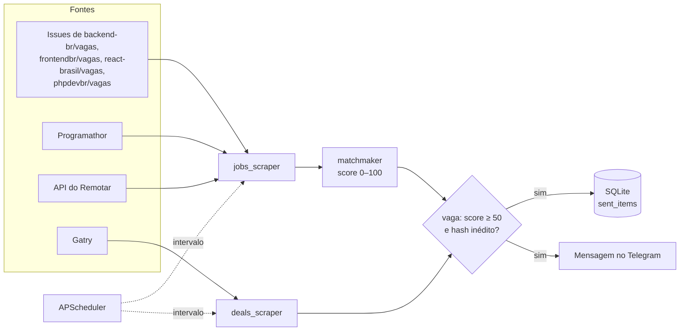

# Telegram Radar Bot

[](https://github.com/MvitorLS/telegram-radar-bot/actions/workflows/tests.yml)

Bot de Telegram que eu uso para não precisar abrir cinco sites por dia atrás de vaga de estágio/júnior. Ele varre as fontes periodicamente, dá uma nota de compatibilidade para cada vaga com base no meu perfil e só me avisa do que passou do corte — sem repetir o que já foi enviado. De bônus, acompanha promoções de hardware.

Rodando como [@VaigasBot](https://t.me/VaigasBot).

## Como funciona



- **Coleta** (`scrapers/`): `httpx` assíncrono + BeautifulSoup. Vagas vêm das issues dos repositórios comunitários via API do GitHub, do Programathor (HTML) e da API JSON pública do Remotar; promoções vêm do Gatry.
- **Pontuação** (`matchmaker.py`): nível da vaga (estágio/júnior/trainee) pesa 35%, tecnologias do perfil em `config.py` até 45% e localização (Curitiba/PR/remoto) 20%; vagas pleno/sênior perdem 30 pontos. A comparação é por palavra inteira, então "pr" não casa com "programador". O aviso automático só dispara para nota ≥ 50; nos comandos manuais o corte é mais baixo (35).
- **Deduplicação** (`database.py`): cada item vira um hash de `url + título`; o que já está em `sent_items` não é reenviado.
- **Agendamento**: `APScheduler` roda vagas a cada `JOBS_CHECK_INTERVAL` e promoções a cada `DEALS_CHECK_INTERVAL` minutos, para cada chat com o radar ligado.

## Comandos

| Comando | O que faz |
| --- | --- |
| `/start` | Menu com botões |
| `/vagas` | Busca agora e lista as vagas com maior nota |
| `/promocoes` | Promoções do dia |
| `/buscar <termo>` | Filtra vagas e promoções por termo (`/buscar react`, `/buscar curitiba`) |
| `/perfil` | Mostra o perfil usado na pontuação |
| `/radar_on` · `/radar_off` | Liga/desliga os avisos automáticos |
| `/status` | Contadores de itens enviados e intervalos configurados |

## Rodando

Crie um bot no [@BotFather](https://t.me/BotFather) e copie o token.

```bash
cp .env.example .env        # preencha TELEGRAM_BOT_TOKEN
docker compose up -d        # ou: python -m venv .venv && pip install -r requirements.txt && python bot.py
```

Para testar a coleta e a pontuação sem Telegram:

```bash
python cli_test.py
```

Testes (pontuação, deduplicação no SQLite e scrapers com HTTP simulado via `httpx.MockTransport`):

```bash
pip install -r requirements-dev.txt
pytest
```

Para adaptar a outro perfil, edite `PROFILE` em `config.py` (skills, níveis-alvo, localização).

## Stack

Python 3.14 · python-telegram-bot 22 (async) · httpx · BeautifulSoup4 · APScheduler · aiosqlite · Docker

## Limitações conhecidas

- Scraping de HTML quebra quando o site muda o layout; a API do GitHub sem token tem limite de 60 req/h.
- A pontuação é por palavra-chave, então "Node" citado de passagem numa vaga de Java ainda soma pontos.
- Falhas de uma fonte são só logadas; a coleta segue com as outras.
